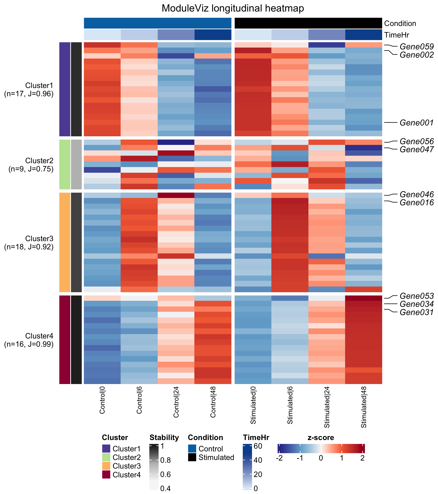
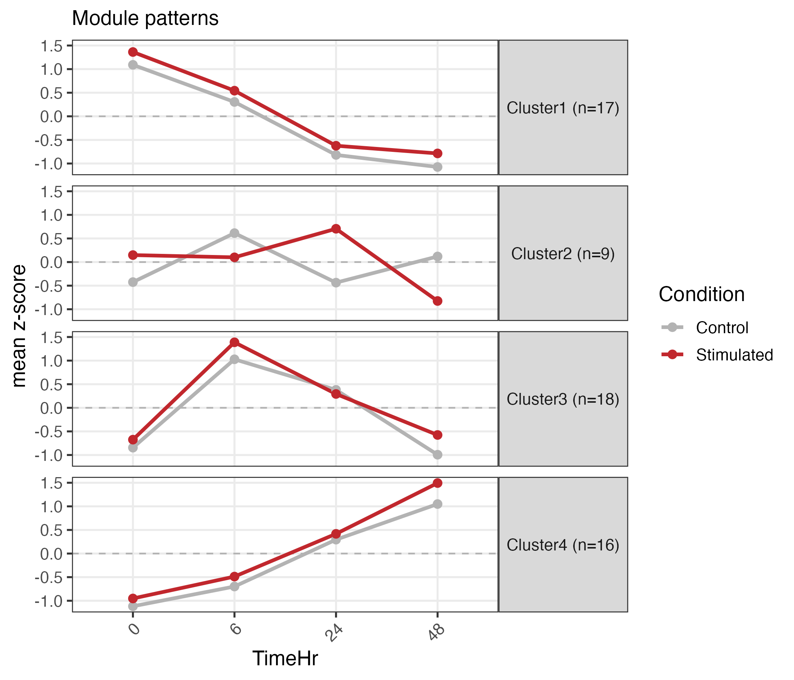
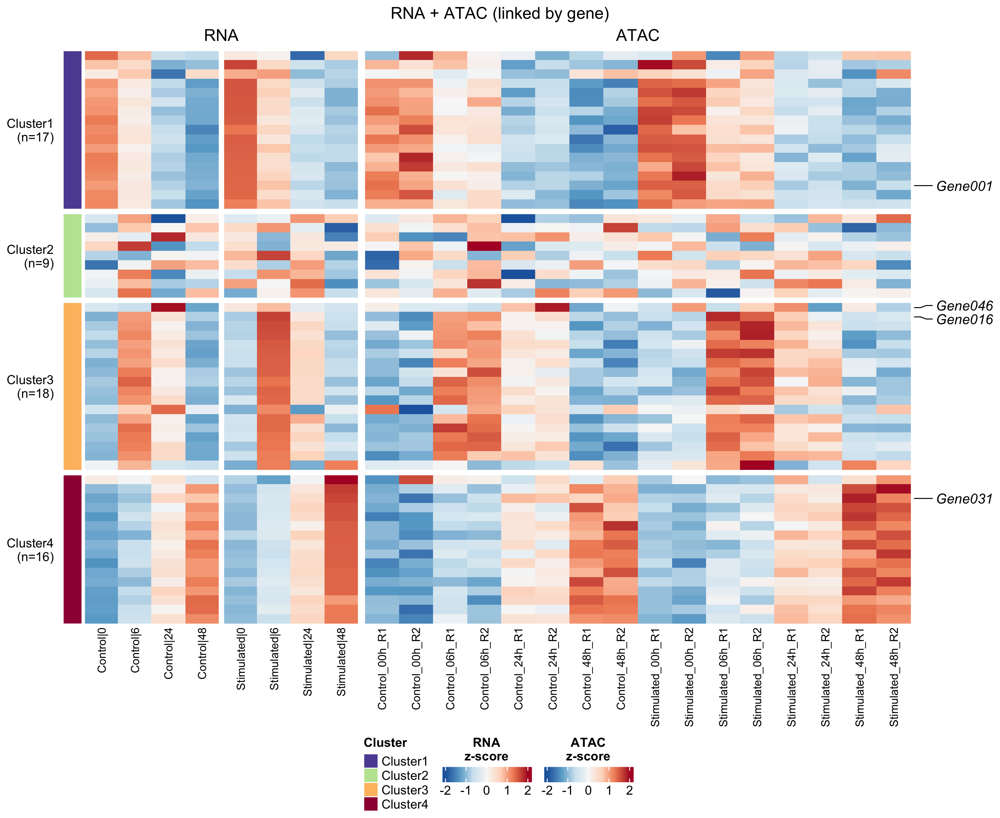
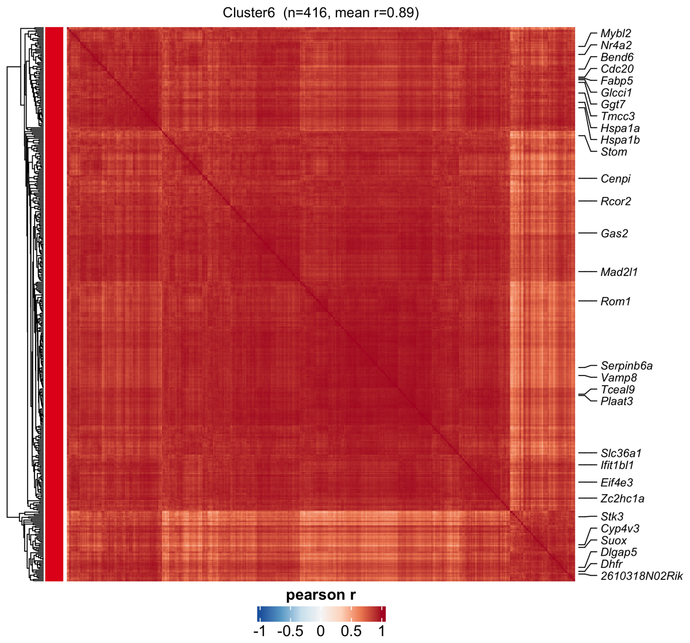
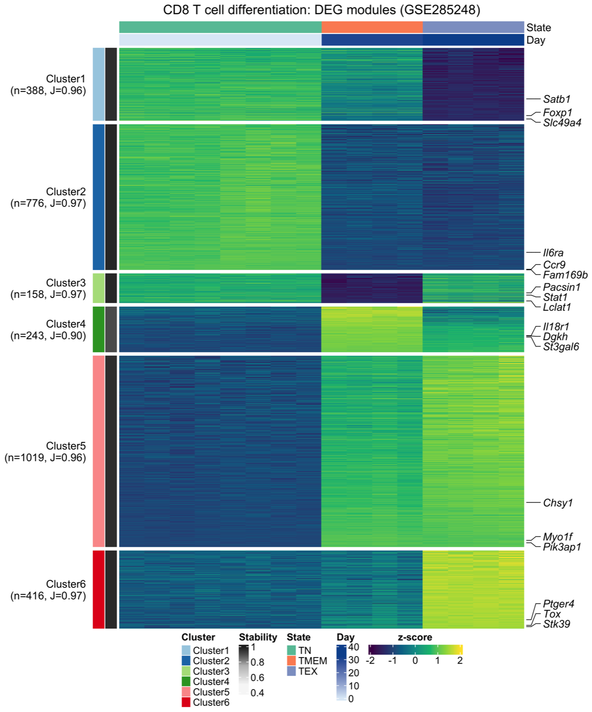
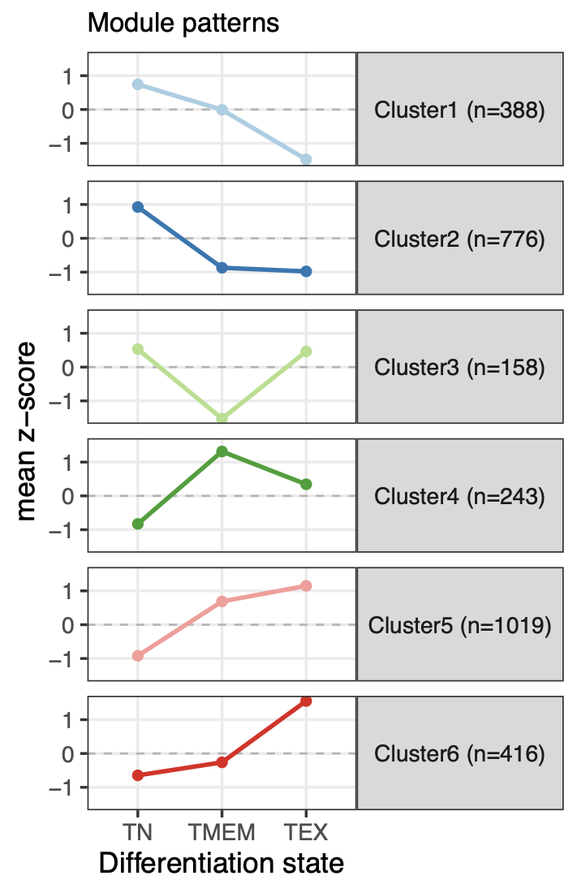
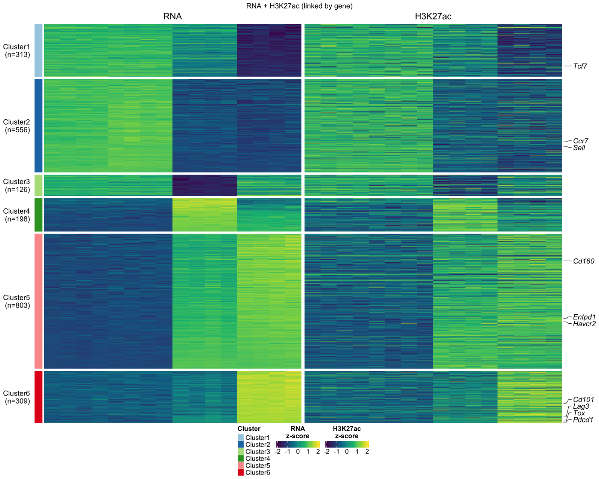
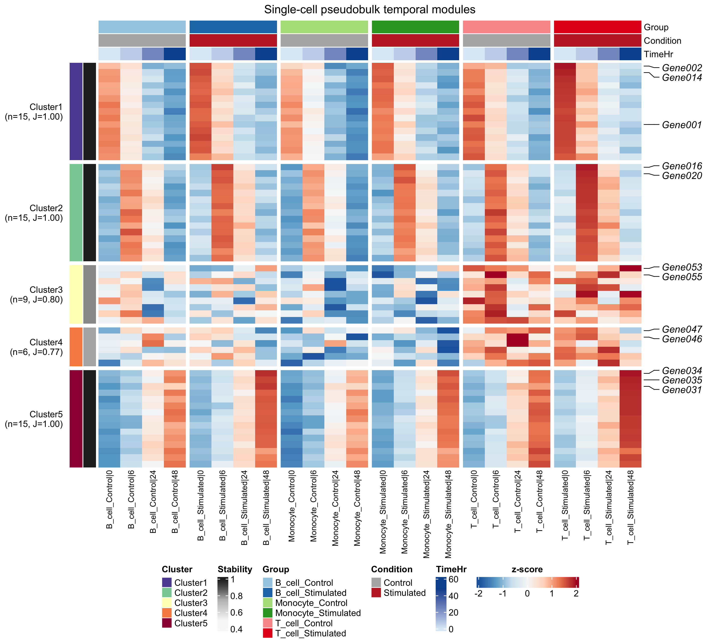
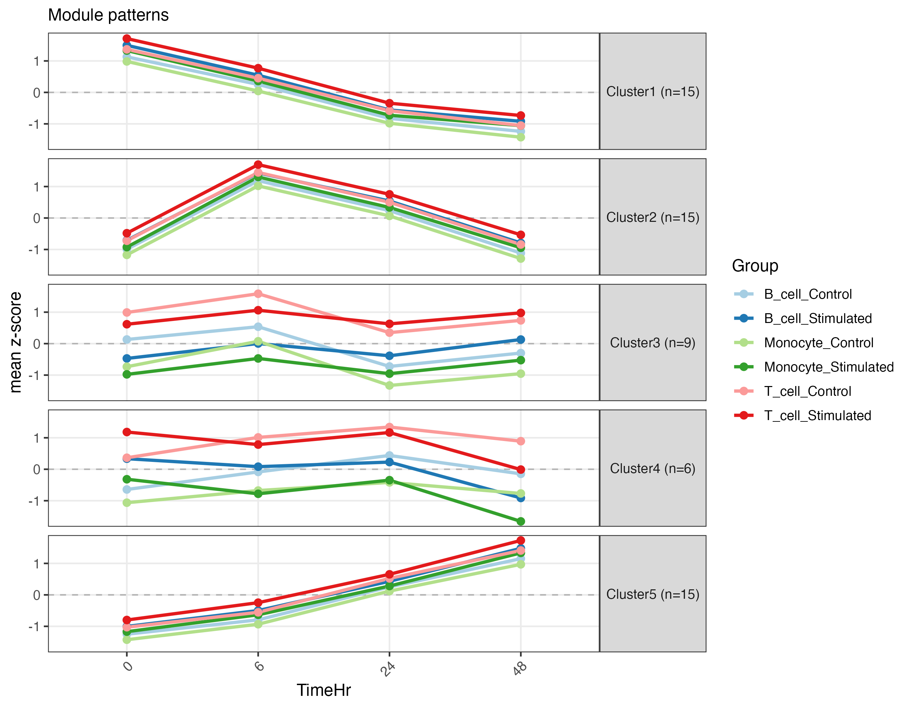

# ModuleViz: Longitudinal Omics Heatmaps and Temporal Module Plots

#### Hua Huang

#### 2026-08-04

Source: `vignettes/ModuleViz.Rmd`

## Introduction

`ModuleViz` is an R package for clustering and visualizing longitudinal
high-throughput omics data. It is designed for feature-by-sample matrices from
RNA-seq, ATAC-seq, CUT&Run, pseudobulk single-cell summaries, and related
time-course or ordered-state experiments.

The central question addressed by `ModuleViz` is: which genes, peaks, or other
features follow similar temporal patterns across an ordered biological axis?
The axis can be clock time, treatment dose, differentiation state, disease
stage, exhaustion state, or another numeric ordering supplied by the user.

`ModuleViz` takes a numeric matrix and sample metadata table, z-scores features
by row, clusters features into temporal modules, orders modules from
early-peaking to late-peaking patterns, and renders the result as heatmaps,
module trajectory plots, paired-omics heatmaps, and module coherence
diagnostics. Heatmaps are drawn with
[`ComplexHeatmap`](https://bioconductor.org/packages/ComplexHeatmap/), so the
package fits naturally into Bioconductor workflows.

The main functions are:

- `longitudinal_cluster()`: cluster features into ordered temporal modules.
- `longitudinal_heatmap()`: draw annotated module heatmaps.
- `pattern_lineplot()`: plot mean module trajectories.
- `dual_omics_heatmap()`: align a second omics layer, such as ATAC or CUT&Run,
  to RNA-defined modules.
- `module_correlation_heatmap()`: inspect gene-gene correlation within modules.
- `module_correlation_summary()`: summarize within-module coherence.
- `choose_k()`: calculate module-number diagnostics.
- `cluster_stability()`: estimate module reproducibility by resampling.
- `write_memberships()`: export feature-to-module tables and module summaries.
- `run_longitudinal()`: run clustering, plotting, and export in one call.

## Installation

`ModuleViz` is currently available from GitHub. Install the required
Bioconductor dependencies first:

```r
if (!requireNamespace("BiocManager", quietly = TRUE))
    install.packages("BiocManager")

BiocManager::install(c("ComplexHeatmap", "circlize"))
install.packages(c("cluster", "data.table", "ggplot2", "RColorBrewer",
                   "remotes"))

remotes::install_github("helenhuangmath/ModuleViz")
```

Optional packages are used for vignettes, examples, and package checks:

```r
BiocManager::install(c("BiocStyle", "timecoursedata"))
install.packages(c("knitr", "rmarkdown", "testthat"))
```

For local development from a checked-out repository:

```r
devtools::load_all(".")
```

## Quick Example: Cluster Temporal Modules

The quick example below uses the bundled `heatmap_example` dataset. The matrix
contains features in rows and samples in columns. The metadata table contains
one row per sample and identifies sample ID, time, condition, and replicate.

```r
library(ModuleViz)

data("heatmap_example")
mat <- heatmap_example$mat
meta <- heatmap_example$meta

obj <- longitudinal_cluster(
    mat,
    meta,
    sample_col = "SampleID",
    time_col = "TimeHr",
    group_col = "Condition",
    k = 4,
    method = "kmeans",
    aggregate_replicates = TRUE,
    stability = TRUE
)

longitudinal_heatmap(
    obj,
    annotation_cols = c("Condition", "TimeHr"),
    top_n_label = 3,
    cluster_palette = "paired",
    title = "Example longitudinal modules",
    file = "moduleviz_heatmap.pdf"
)
```

The resulting object is a `longi` list containing the z-scored matrix, ordered
module assignments, module centroids, stability estimates, reordered metadata,
and the parameters used to create the result.

## Longitudinal Module Analysis

This section follows the same workflow used in the package vignettes.

### Load Packages

```r
library(ModuleViz)
library(data.table)
```

### Input Data

`ModuleViz` requires two plain R objects:

- a numeric matrix, with features in rows and samples in columns;
- a metadata table, with one row per sample.

The metadata must contain a sample ID column matching the matrix column names
and a numeric ordering column. A grouping column is optional and can represent
condition, genotype, treatment, cell type, or another factor.

```r
dim(mat)
head(meta)
```

Values are z-scored by row inside `longitudinal_cluster()` unless
`is_zscore = TRUE` is supplied. Feature selection should be done upstream,
using differential analysis, a variance filter, or another criterion suitable
for the experiment.

### Choose The Number Of Modules

`choose_k()` calculates an elbow diagnostic and mean silhouette width across a
range of candidate module numbers.

```r
diag <- choose_k(
    zscore_rows(mat),
    k_range = 2:10,
    method = "kmeans",
    chosen_k = 4,
    file = "choose_k_elbow.pdf"
)

diag
attr(diag, "suggested_k")
```

The elbow estimate is a diagnostic. The final module number should also reflect
biological interpretability and module stability.

### Cluster Features

```r
obj <- longitudinal_cluster(
    mat,
    meta,
    sample_col = "SampleID",
    time_col = "TimeHr",
    group_col = "Condition",
    k = 4,
    method = "kmeans",
    stability = TRUE,
    n_resample = 20,
    seed = 1
)

obj
obj$stability
```

Modules are automatically ordered by the time point where each module centroid
peaks. `Cluster1` is therefore the earliest-peaking module and the last cluster
is the latest-peaking module.

### Draw The Module Heatmap

```r
longitudinal_heatmap(
    obj,
    annotation_cols = c("Condition", "TimeHr"),
    top_n_label = 3,
    zscore_palette = "rdbu",
    cluster_palette = "paired",
    annotation_palette = "set2",
    file = "moduleviz_heatmap.pdf",
    width = 9,
    height = 12
)
```



Rows are split by module and ordered from early-peaking to late-peaking
patterns. Columns are ordered by the numeric time variable and can be split by
the optional grouping variable. Metadata columns are shown as annotation bars.

### Plot Module Trajectories

```r
pattern_lineplot(
    obj,
    palette = "set2",
    file = "moduleviz_patterns.pdf"
)
```



The line plot shows the mean z-score trajectory for each module and is useful
for describing module behavior in text.

### Export Module Tables

```r
write_memberships(obj, prefix = "moduleviz")
```

This writes:

- `moduleviz_memberships.txt`
- `moduleviz_centroids.txt`
- `moduleviz_stability.txt`

The membership table can be used for downstream enrichment analysis one module
at a time.

## Function Tutorials

The examples below describe each exported function and the object it expects.
They use the same `heatmap_example` data introduced above unless noted
otherwise.

### `zscore_rows()`

`zscore_rows()` centers and scales each feature across samples. It is called
inside `longitudinal_cluster()`, but it is useful when checking diagnostics or
preparing input for `choose_k()`.

```r
z <- zscore_rows(mat)
round(rowMeans(z)[1:5], 6)
round(apply(z, 1, sd)[1:5], 6)
```

Rows with zero variance are returned as zero rather than `NaN`, so they do not
break clustering.

### `choose_k()`

`choose_k()` evaluates candidate module numbers. The returned table contains
the total within-cluster sum of squares and mean silhouette width for each `k`.
The attribute `suggested_k` stores the elbow estimate.

```r
diag <- choose_k(
    z,
    k_range = 2:8,
    method = "kmeans",
    chosen_k = 4,
    file = "choose_k_elbow.pdf"
)

attr(diag, "suggested_k")
```

Use this as a diagnostic, then choose a value that gives stable and
interpretable modules.

### `longitudinal_cluster()`

`longitudinal_cluster()` is the core analysis function. It checks the matrix and
metadata, z-scores rows, optionally aggregates replicates, clusters features,
orders modules, orders rows within modules, and stores metadata needed by the
plotting functions.

```r
obj <- longitudinal_cluster(
    mat,
    meta,
    sample_col = "SampleID",
    time_col = "TimeHr",
    group_col = "Condition",
    k = 4,
    method = "kmeans",
    aggregate_replicates = TRUE,
    stability = TRUE,
    n_resample = 20,
    seed = 1
)

names(obj)
head(obj$membership)
```

Supported clustering methods are `"kmeans"`, `"hierarchical"`, and `"pam"`.
Set `dist_method = "correlation"` when trajectory shape is more important than
amplitude.

### `cluster_stability()`

`cluster_stability()` estimates how reproducible each module is by subsampling
features, reclustering, and calculating the best Jaccard overlap with the
original module.

```r
stab <- cluster_stability(
    obj$z,
    obj$cluster,
    k = 4,
    method = "kmeans",
    n_resample = 20,
    seed = 1
)

stab
```

High values indicate modules that are robust to feature subsampling. Values
below roughly 0.6 should be interpreted cautiously.

### `resolve_labels()`

`resolve_labels()` determines which rows will be labeled on a heatmap. Labels
can come from an explicit feature list, from the top features per module by
signal strength, or from a user-supplied ranking table.

```r
rank_table <- data.frame(
    ID = rownames(obj$z),
    value = runif(nrow(obj$z))
)

labels <- resolve_labels(
    obj,
    features = c("Gene001", "Gene016"),
    top_n = 2,
    rank_table = rank_table,
    id_field = "ID",
    value_field = "value"
)

head(labels)
```

The returned table is used internally by `longitudinal_heatmap()`.

### `longitudinal_heatmap()`

`longitudinal_heatmap()` draws the main module heatmap. Rows are split by
ordered module, columns are ordered by `time_col`, and selected metadata
columns become top annotation bars.

```r
longitudinal_heatmap(
    obj,
    annotation_cols = c("Condition", "TimeHr"),
    top_n_label = 3,
    zscore_palette = "rdbu",
    cluster_palette = "paired",
    annotation_palette = "set2",
    show_column_names = TRUE,
    file = "moduleviz_heatmap.pdf"
)
```

Use `zscore_palette = "viridis"` for a perceptually uniform heatmap body, and
use `annotation_colors` when exact metadata colors are needed.

### `pattern_lineplot()`

`pattern_lineplot()` returns a `ggplot` object showing the mean trajectory of
each module.

```r
p <- pattern_lineplot(
    obj,
    palette = "set2",
    base_size = 12,
    title = "Module trajectories"
)

p
```

When `group_col` was supplied to `longitudinal_cluster()`, each group is drawn
as a separate colored line.

### `module_correlation_summary()`

`module_correlation_summary()` returns a compact table of within-module
correlation statistics.

```r
module_correlation_summary(obj)
```

This is useful for identifying modules that may contain multiple subprograms.

### `module_correlation_heatmap()`

`module_correlation_heatmap()` draws feature-feature correlation heatmaps within
one or more modules.

```r
module_correlation_heatmap(
    obj,
    clusters = "Cluster1",
    max_genes = 60,
    label_top_n = 20,
    file = "module_correlation.pdf"
)
```

A `.pdf` file collects multiple modules as pages. Other extensions write one
file per module.

### `dual_omics_heatmap()`

`dual_omics_heatmap()` aligns a secondary assay to the primary module order by
gene. The primary layer defines the modules; the secondary layer is displayed
in the same gene order.

```r
genes <- rownames(mat)
atac <- mat[rep(seq_along(genes), each = 2), , drop = FALSE]
rownames(atac) <- paste0(
    "Peak",
    sprintf("%03d", seq_len(nrow(atac))),
    "_",
    rep(genes, each = 2)
)

dual_omics_heatmap(
    primary = obj,
    secondary = atac,
    primary_name = "RNA",
    secondary_name = "ATAC",
    gene_of_primary = function(id) id,
    gene_of_secondary = function(id) sub("^.*_", "", id),
    aggregate = "mean",
    file = "rna_atac_heatmap.pdf"
)
```

Use `aggregate = "top"` when the strongest secondary feature per gene is more
appropriate than the mean.

### `write_memberships()`

`write_memberships()` exports module assignments and, by default, module
centroids and stability estimates.

```r
write_memberships(obj, prefix = "moduleviz")
```

The exported membership table is the usual input for downstream gene set,
pathway, or motif enrichment analyses.

### `run_longitudinal()`

`run_longitudinal()` is a convenience wrapper for a finalized workflow. It
runs clustering, writes the heatmap, writes the trajectory plot, and exports
membership tables.

```r
run_longitudinal(
    mat,
    meta,
    out_prefix = "moduleviz",
    sample_col = "SampleID",
    time_col = "TimeHr",
    group_col = "Condition",
    k = 4,
    top_n_label = 3
)
```

Use the lower-level functions during exploration, then switch to
`run_longitudinal()` when parameters are settled.

### `available_real_timecourse_datasets()` and `load_real_timecourse_example()`

These helpers expose optional public datasets from the Bioconductor
`timecoursedata` package.

```r
available_real_timecourse_datasets()

example <- load_real_timecourse_example(
    dataset = "sorghum_leaf",
    genotype = "BT642",
    min_week = 3,
    top_n_features = 1000
)
```

The returned object contains `mat`, `meta`, and the column names to pass to
`longitudinal_cluster()`.

## Paired Omics Analysis

`dual_omics_heatmap()` compares two assays in a shared row order. The primary
layer, often RNA, defines the module structure. The secondary layer, such as
ATAC or CUT&Run, is aligned by gene and shown beside the primary layer.

```r
rna_obj <- longitudinal_cluster(
    rna,
    meta,
    sample_col = "SampleID",
    time_col = "TimeHr",
    group_col = "Genotype",
    k = 10
)

dual_omics_heatmap(
    primary = rna_obj,
    secondary = atac,
    primary_name = "RNA",
    secondary_name = "ATAC",
    gene_of_secondary = function(id) sub("^.*_", "", id),
    aggregate = "mean",
    label_features = c("Sox2", "Pax6"),
    file = "rna_atac_heatmap.pdf"
)
```



When multiple secondary features map to one gene, `aggregate = "mean"` averages
them and `aggregate = "top"` keeps the strongest feature.

## Module Coherence

Temporal clustering can group features with similar average profiles, but a
module should still be checked for internal coherence. The correlation helpers
summarize and visualize feature-feature agreement within each module.

```r
module_correlation_summary(obj)

module_correlation_heatmap(
    obj,
    clusters = "Cluster1",
    max_genes = 60,
    file = "module_correlation.pdf"
)
```



A coherent module appears as a high-correlation block. Visible sub-blocks can
indicate that the module should be split by increasing `k`.

## Published Data Example

The vignette `vignette("cd8-exhaustion-published-data")` demonstrates a
published-data workflow using RNA-seq and CUT&Run data from memory and
exhausted CD8 T cells. RNA-seq defines the modules and H3K27ac signal is
aligned to those modules by gene.







## Single-Cell Pseudobulk Example

Single-cell data can be summarized into pseudobulk profiles by sample, cell
type, condition, time point, and replicate. The resulting matrix can be analyzed
with the same `ModuleViz` functions.

```r
source("examples/example_single_cell_pseudobulk.R")
```





## Public Time-Course Data

The optional helper `load_real_timecourse_example()` loads supported public
datasets from the Bioconductor `timecoursedata` package and returns a matrix and
metadata table ready for `ModuleViz`.

```r
available_real_timecourse_datasets()

example <- load_real_timecourse_example(
    dataset = "sorghum_leaf",
    genotype = "BT642",
    min_week = 3,
    top_n_features = 1000
)

obj <- longitudinal_cluster(
    example$mat,
    example$meta,
    sample_col = example$sample_col,
    time_col = example$time_col,
    group_col = example$group_col,
    k = 5,
    aggregate_replicates = TRUE,
    stability = TRUE
)
```

See `examples/example_real_timecoursedata.R` and
`vignettes/longitudinal-heatmap-tutorial.Rmd` for a complete workflow.

## Vignettes

The package includes three Bioconductor-style vignettes:

- `vignette("ModuleViz")`: complete user guide.
- `vignette("cd8-exhaustion-published-data")`: published RNA-seq and CUT&Run
  workflow.
- `vignette("longitudinal-heatmap-tutorial")`: tutorial using bundled and
  optional public time-course data.

HTML versions are available in `docs/`:

- `docs/index.html`: HTML README/package overview.
- `docs/articles/ModuleViz.html`: complete user guide.
- `docs/articles/cd8-exhaustion-published-data.html`: published-data workflow.
- `docs/articles/longitudinal-heatmap-tutorial.html`: longitudinal heatmap
  tutorial.

## Package Checks

Before Bioconductor submission, run checks from a clean R/Bioconductor
environment with all required and suggested dependencies installed:

```bash
R CMD build .
R CMD check --no-manual ModuleViz_*.tar.gz
```

Run Bioconductor-specific checks:

```r
if (!requireNamespace("BiocManager", quietly = TRUE))
    install.packages("BiocManager")

BiocManager::install("BiocCheck")
BiocCheck::BiocCheck(".")
```

## Citation

After installation, cite `ModuleViz` from R with:

```r
citation("ModuleViz")
```

## License

`ModuleViz` is distributed under the MIT license.
